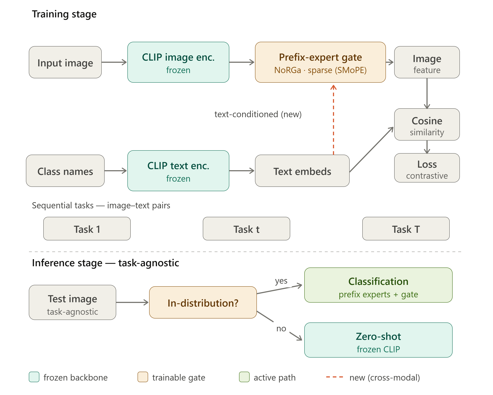

# Cổng Prefix-Expert Có Cơ Sở Lý Thuyết Cho Continual CLIP
### Cổng tốt hơn có bảo vệ căn chỉnh liên phương thức và zero-shot transfer không?

**Phạm vi:** continual learning cho VLM dự đoán (CLIP, dual-encoder). **Backbone:** CLIP ViT-B/16. **Benchmark:** MTIL.
**Định vị:** nằm giữa NoRGa (lý thuyết gating, ViT đơn phương thức) và MoE-Adapters (CLIP, gating đơn giản), lấp khoảng trống mà cả hai hướng chưa xử lý.

---

## 1. Phát biểu bài toán

Continual learning cho phép một vision-language model tiếp nhận task mới mà không cần xem lại dữ liệu cũ, nhưng fine-tuning CLIP tuần tự một cách trực tiếp gây ra hai lỗi đặc thù của VLM và không xuất hiện trong continual learning đơn phương thức: **trôi đặc trưng liên phương thức** (không gian embedding ảnh và text bị lệch nhau) và **suy giảm năng lực zero-shot** (khả năng tổng quát open-vocabulary sụp giảm khi model quá chuyên biệt hóa). Parameter-efficient adaptation (PEA), tức đóng băng backbone và chỉ học các module nhỏ được thêm vào, là hướng phòng vệ chính.

Trong PEA, có hai nhánh nghiên cứu đã phát triển độc lập và hầu như chưa được nối lại:

- **Nhánh lý thuyết gating (NoRGa, SMoPE; NeurIPS 2024 / ICLR 2026).** Các công trình này cho thấy attention block của một ViT đóng băng có thể được hiểu ngầm như mixture-of-experts, diễn giải lại prefix tuning như việc *thêm expert*, và chứng minh rằng gating *tuyến tính* ngầm định là kém hiệu quả về mẫu (tốc độ ước lượng tham số có thể chậm tới `O(1/log^t(n))`). Họ khắc phục bằng non-linear residual gate (NoRGa) và sparse prompt experts (SMoPE), cải thiện tốc độ lên xấp xỉ `O(root4(log n / n))`. **Nhưng toàn bộ nhánh này là phân loại với ViT đơn phương thức**: không có encoder thứ hai, không có căn chỉnh liên phương thức, và không có zero-shot transfer cần bảo vệ.
- **Nhánh CLIP/VLM (MoE-Adapters, CVPR 2024; MoE-Adapters++/LEAS, TPAMI 2025).** Các công trình này đưa MoE-LoRA experts vào CLIP và thêm bộ chọn out-of-distribution để bảo toàn zero-shot. **Nhưng expert gating của chúng vẫn là task-specific router đơn giản, không dùng lý thuyết gating.**

**Khoảng trống.** Chưa có công trình nào đưa prefix-expert gating có cơ sở lý thuyết vào chế độ CLIP liên phương thức. Đây không chỉ là "NoRGa trên backbone khác": khi chuyển từ một ViT sang hai encoder được căn chỉnh tương phản của CLIP, ta gặp các vấn đề mà nhánh lý thuyết gating không đặt ra được. Vì vậy các câu hỏi nghiên cứu trung tâm là:

1. **(Hiệu quả mẫu)** Gating có cơ sở lý thuyết có cải thiện hiệu quả mẫu trong *few-shot* continual CLIP adaptation, nơi dữ liệu mỗi task rất ít, hay không?
2. **(Liên phương thức, câu hỏi phân biệt chính)** Lựa chọn cơ chế gating có ảnh hưởng cụ thể đến **căn chỉnh liên phương thức** và **zero-shot transfer**, tức các lỗi không tồn tại trong thế giới đơn phương thức của NoRGa, hay không?

Câu hỏi 2 là điều làm hướng này trở thành một đóng góp CLIP, không chỉ là thay backbone. Nếu gate tốt hơn chỉ tăng accuracy nhưng alignment và zero-shot không đổi, công trình sẽ bị rút gọn thành NoRGa-on-CLIP. Dự án này được định nghĩa bởi việc xử lý chiều liên phương thức, không phải chỉ bởi gate.

---

## 2. Kiến trúc

Một CLIP dual-encoder đóng băng, với prefix experts có cơ sở lý thuyết được chèn vào attention của **image encoder**. Việc đặt expert vào text encoder là một ablation, không phải giả định mặc định.



Các thành phần:
- **Frozen CLIP backbone** (image encoder + text encoder): giữ lại tri thức liên phương thức đã pretrained.
- **Prefix experts** trong attention của image encoder: các prefix value vector định nghĩa expert mới, còn prefix key vector cung cấp gating score của chúng (theo cách diễn giải NoRGa/SMoPE).
- **NoRGa non-linear residual gate** chỉ áp dụng cho *prefix experts*; các pretrained experts giữ nguyên gate gốc để làm điểm neo ổn định.
- **Sparse prompt experts (kiểu SMoPE)**: một tập prompt dùng chung, được cấu trúc thành sparse experts với top-k activation, giúp giữ bộ nhớ *không tăng theo số task* thay vì tăng dần như expert theo task.
- **Text-conditioned gating (thành phần liên phương thức bản địa)**: class-name text embeddings cung cấp semantic prior cho việc chọn/gate prefix experts. Đây là tín hiệu đa phương thức mà NoRGa đơn phương thức không thể dùng.
- **Task-time continual update, query-time routing**: task mới chỉ cập nhật prefix/gate/anchor parameters; query sample dùng cached text embeddings đã đóng băng để điều kiện hóa gate, nhưng mặc định không update online.
- **CLIP-native classifier**: dùng cosine similarity giữa ảnh và text, không dùng learned head riêng.
- **Zero-shot preservation path**: input chưa biết có thể fallback về frozen CLIP, giữ nhẹ và được định vị so với LEAS; xem mục 5.

---

## 3. Phương pháp

**3.1 Prefix experts trong CLIP attention.** Ở mỗi attention block được chọn, prepend các prefix key/value vectors. Theo góc nhìn prefix-MoE, mỗi prefix value vector định nghĩa một expert output mới $f_{N+j}(X) = W^V p^V_j$, còn mỗi prefix key vector định nghĩa gating score của expert đó:

$$
s_{i,N+j}(X) = \frac{x_i^\top W^Q (W^K)^\top p^K_j}{\sqrt{d}} .
$$

Block trở thành một MoE với hai nhóm expert: pretrained experts đóng băng và learned prefix experts.

**3.2 Non-linear residual gate.** Thay gating score tuyến tính của prefix experts bằng:

$$
s_{\mathrm{NoRGa}} = s + \sigma(\mathrm{transform}(s)).
$$

Activation phi tuyến phá vỡ suy biến của linear gating (nguồn gốc của tốc độ ước lượng chậm); nhánh residual giữ lại đường tuyến tính để tránh gradient biến mất và cho phép quay về gate gốc ở lúc khởi tạo. Chỉ áp dụng cho prefix experts; pretrained experts không bị đụng tới.

**3.3 Sparse activation (kiểu SMoPE).** Duy trì một tập prompt experts dùng chung qua các task. Dùng phép tổng hợp prompt-attention score để tính proxy score cho từng expert và chỉ kích hoạt top-k experts cho mỗi input, nhờ đó giảm interference. Thêm adaptive-noise term để khuyến khích cân bằng sử dụng expert và bảo vệ các expert từng quan trọng trước đó. Kết quả là ngân sách tham số/bộ nhớ gần như không đổi theo số task.

**3.4 Text-conditioned gating.** Điều kiện hóa gating score bằng CLIP text embeddings của các candidate class names, thông qua việc cộng một semantic bias từ text vào expert logits từ ảnh. Dạng mong muốn là cộng bias, không concat token:

$$
s_l = s^{\mathrm{img}}_l + \alpha_l s^{\mathrm{txt}}_l .
$$

Trong đó $s^{\mathrm{img}}_l$ được tạo từ CLS/token representation phía image, $s^{\mathrm{txt}}_l$ được tạo từ text context vector, và $\alpha_l$ là hệ số theo layer có thể học được, khởi tạo gần 0. Sau đó áp dụng NoRGa residual non-linearity và SMoPE top-k selection lên fused score. Cách này giữ image-only gate làm điểm khởi tạo và baseline ablation ($\alpha_l = 0$), đồng thời cho phép ngữ nghĩa text bias việc chọn expert.

Text context không được dùng ground-truth label ở query time. Trong task-incremental evaluation, có thể dùng mean text embedding của tập class thuộc task đã biết. Trong domain/class-incremental hoặc task-unknown evaluation, trước tiên tính frozen CLIP zero-shot posterior, rồi lấy top-m weighted mean của candidate class text embeddings. Như vậy gate có text-aware signal mà không bị label leakage.

**3.5 Luồng query-time.** Ở inference/query time, model thực hiện text-aware routing nhưng mặc định không update parameter online:

1. Encode ảnh qua frozen/anchor CLIP path để lấy global image feature.
2. So sánh feature đó với cached CLIP text embeddings của candidate class set.
3. Xây dựng text context từ top-m text embeddings, có trọng số theo posterior.
4. Ở mỗi image-encoder layer được chọn, fuse image gate logits và text-prior logits.
5. Áp dụng NoRGa residual gate và SMoPE top-k selection để kích hoạt prefix experts.
6. Sinh dự đoán cuối bằng cosine similarity giữa image và text theo CLIP.

Vì vậy text embedding là tín hiệu điều kiện hóa ở routing time, không phải mục tiêu học ở test time. Gradients và EMA updates bị tắt trong query path chính để tránh pseudo-label drift và giữ đánh giá zero-shot transfer sạch.

**3.6 Ranh giới continual update.** Continual-learning update xảy ra khi task mới xuất hiện, không phải khi một unlabeled query sample xuất hiện. Với mỗi task mới, cache class-name text embeddings, train/update prefix experts, gate projections, text-prior projection, expert semantic anchors, và hệ số fusion theo layer `alpha_l`, trong khi CLIP backbone vẫn đóng băng. Ở query time, các tham số đã học đó được dùng lại mà không sửa đổi.

Online query-time adaptation được xem là ablation tùy chọn, không phải main method. Biến thể an toàn nhất là confidence-gated EMA cho expert semantic anchors mà không backpropagation; pseudo-label gradient updates rủi ro hơn vì lỗi routing ban đầu có thể tự củng cố và làm xói mòn cross-modal alignment của CLIP.

**3.7 Mục tiêu huấn luyện.** Với mỗi task, tối ưu CLIP-style contrastive cross-modal alignment loss trên dữ liệu task mới (few-shot), chỉ update prefix/gate/text-prior parameters; backbone vẫn đóng băng. Có thể thêm alignment/distillation regularizer nhẹ kiểu ZSCL để bảo vệ zero-shot rõ hơn, biến phương pháp thành hybrid giữa PEA và regularization.

**3.8 Ghi chú lý thuyết (mở, sẽ kiểm tra, không khẳng định trước).** Tốc độ sample-efficiency của NoRGa được suy ra cho attention-MoE đơn encoder trong bài toán *classification regression*. Objective của CLIP là *contrastive cross-modal alignment*. Việc bảo đảm `O(root4(log n / n))` có chuyển sang objective mới này hay không vẫn là câu hỏi mở. Ta sẽ kiểm tra; nếu chuyển được thì là đóng góp tốt, còn nếu không chuyển được thì cũng là một kết quả thú vị, giúp xác định khi nào theory-grounded gating thật sự có ích.

---

## 4. Cơ sở lý thuyết và công thức

Mục này ghi rõ các công thức cần triển khai/viết paper. Ký hiệu: `x` là ảnh, `c` là class name, `f_I` và `f_T` là image/text encoder của CLIP, `l` là layer, `j` là expert index, `E_j` là prefix expert thứ `j`, `k` là số expert được chọn.

**4.1 CLIP-native prediction.** Với prompt template `P(c)`, text embedding và image embedding được chuẩn hóa:

$$
\begin{aligned}
v &= \mathrm{normalize}(f_I(x)), \\
t_c &= \mathrm{normalize}(f_T(P(c))).
\end{aligned}
$$

Logit phân loại theo CLIP:

$$
\begin{aligned}
\mathrm{logit}_c(x) &= \exp(\tau)\, v^\top t_c, \\
p(c \mid x) &= \mathrm{softmax}_c(\mathrm{logit}_c(x)).
\end{aligned}
$$

Điểm quan trọng: classifier cuối vẫn là image-text similarity, không thêm learned linear head. Điều này giữ method nằm trong regime CLIP-native và cho phép đo zero-shot transfer trực tiếp.

**4.2 Prefix attention như một MoE.** Với hidden states `X_l`, attention thông thường dùng:

$$
\begin{aligned}
Q &= X_l W_Q, \\
K &= X_l W_K, \\
V &= X_l W_V, \\
\mathrm{Attn}(X_l) &= \mathrm{softmax}\left(\frac{QK^\top}{\sqrt{d}}\right)V.
\end{aligned}
$$

Khi thêm prefix keys/values $P_K = [p^K_1, \ldots, p^K_M]$ và $P_V = [p^V_1, \ldots, p^V_M]$:

$$
\begin{aligned}
K' &= \mathrm{concat}(K, P_K), \\
V' &= \mathrm{concat}(V, P_V), \\
\mathrm{Attn}_{\mathrm{prefix}}(X_l)
&= \mathrm{softmax}\left(\frac{Q{K'}^\top}{\sqrt{d}}\right)V'.
\end{aligned}
$$

Phần đóng góp của prefix expert `j` tại token `i` có thể viết:

$$
\begin{aligned}
s^{\mathrm{prefix}}_{i,j}
&= \frac{q_i^\top p^K_j}{\sqrt{d}}, \\
o^{\mathrm{prefix}}_{i,j}
&= \mathrm{softmax}\left(s^{\mathrm{prefix}}_{i,*}\right)_j p^V_j .
\end{aligned}
$$

Diễn giải này nối trực tiếp prefix tuning với MoE: prefix value là expert output, prefix key tạo expert gate.

**4.3 NoRGa residual gate.** Linear prefix gate dễ bị giới hạn vì score chỉ là tích vô hướng giữa token/query và prefix key. NoRGa thêm nhánh phi tuyến nhưng giữ residual:

$$
\begin{aligned}
s^{\mathrm{norga}}_l
&= s_l + \gamma_l \phi_l(s_l), \\
\phi_l(s_l)
&= W_{2,l}\,\mathrm{act}(W_{1,l}s_l + b_{1,l}) + b_{2,l}.
\end{aligned}
$$

$\gamma_l$ nên khởi tạo nhỏ hoặc bằng 0 để lúc bắt đầu $s^{\mathrm{norga}}_l$ gần như bằng gate gốc. Như vậy training không phá ổn định ban đầu, nhưng gate vẫn có khả năng học decision boundary phi tuyến.

**4.4 Text-conditioned gate.** Text signal đi vào gate như một semantic prior, không đi vào classifier như một head mới và không dùng ground-truth label ở query time.

Đầu tiên lấy zero-shot posterior từ frozen/anchor CLIP path:

$$
\begin{aligned}
z_0 &= \mathrm{normalize}(f_I^0(x)), \\
T &= [t_1, \ldots, t_C], \\
\pi &= \mathrm{softmax}(\beta z_0 T^\top).
\end{aligned}
$$

Tạo text context bằng top-m weighted mean:

$$
\begin{aligned}
M &= \mathrm{TopM}(\pi, m), \\
c_{\mathrm{txt}}
&= \mathrm{normalize}\left(
\frac{\sum_{c \in M} \pi_c t_c}
{\sum_{c \in M} \pi_c}
\right).
\end{aligned}
$$

Tại layer `l`, image-side gate và text prior:

$$
\begin{aligned}
h_l &= \mathrm{CLS}(X_l), \\
s^{\mathrm{img}}_l &= h_l W^{\mathrm{img}}_l, \\
u_l &= \mathrm{normalize}(W^{\mathrm{txt}}_l c_{\mathrm{txt}}), \\
a_{l,j} &= \mathrm{normalize}(a^{\mathrm{anchor}}_{l,j}), \\
s^{\mathrm{txt}}_{l,j} &= u_l^\top a_{l,j}.
\end{aligned}
$$

Fused gate:

$$
\begin{aligned}
s_l &= s^{\mathrm{img}}_l + \alpha_l s^{\mathrm{txt}}_l, \\
s^{\mathrm{norga}}_l &= s_l + \gamma_l \phi_l(s_l).
\end{aligned}
$$

$\alpha_l$ là hệ số học được theo layer, khởi tạo gần 0. Ablation $\alpha_l = 0$ chính là image-only gate.

**4.5 SMoPE top-k routing.** Chọn sparse expert set:

$$
I_l(x) = \mathrm{TopK}(s^{\mathrm{norga}}_l, k).
$$

$$
g_{l,j}(x) =
\begin{cases}
\dfrac{\exp(s^{\mathrm{norga}}_{l,j})}
{\sum_{r \in I_l(x)} \exp(s^{\mathrm{norga}}_{l,r})},
& j \in I_l(x), \\
0,
& j \notin I_l(x).
\end{cases}
$$

Output adapter/prefix-expert:

$$
\begin{aligned}
y_l &= \sum_{j \in I_l(x)} g_{l,j}(x) E_{l,j}(X_l), \\
X_{l+1} &= X_l + \mathrm{Attn}_l(X_l) + \mathrm{MLP}_l(X_l) + y_l.
\end{aligned}
$$

Trong implementation thực tế có thể đặt `y_l` sau attention hoặc sau MLP tùy codebase; paper cần nói rõ vị trí chèn.

**4.6 Task-time objective.** Khi task `r` đến, chỉ update prefix/gate/text-prior parameters:

$$
\begin{aligned}
\theta_{\mathrm{train}}
&= \{P_K, P_V, W_{\mathrm{img}}, W_{\mathrm{txt}}, A_{\mathrm{anchor}}, \alpha, \gamma, \phi\}, \\
\theta_{\mathrm{frozen}}
&= \{\text{CLIP image encoder}, \text{CLIP text encoder}\}.
\end{aligned}
$$

Loss tổng:

$$
\mathcal{L}
= \mathcal{L}_{\mathrm{clip}}
+ \lambda_{\mathrm{zs}}\mathcal{L}_{\mathrm{zs}}
+ \lambda_{\mathrm{bal}}\mathcal{L}_{\mathrm{bal}}
+ \lambda_{\mathrm{anchor}}\mathcal{L}_{\mathrm{anchor}}.
$$

CLIP-style supervised loss trên task mới:

$$
\mathcal{L}_{\mathrm{clip}}
= \mathrm{CE}\left(
\mathrm{softmax}(\exp(\tau) v_{\mathrm{adapt}} T_{\mathrm{task}}^\top),
y
\right).
$$

Zero-shot distillation để giữ frozen CLIP behavior:

$$
\begin{aligned}
q_0
&= \mathrm{softmax}(\exp(\tau_0) v_0 T_{\mathrm{ref}}^\top), \\
q_{\mathrm{adapt}}
&= \mathrm{softmax}(\exp(\tau) v_{\mathrm{adapt}} T_{\mathrm{ref}}^\top), \\
\mathcal{L}_{\mathrm{zs}}
&= \mathrm{KL}(q_0 \,\|\, q_{\mathrm{adapt}}).
\end{aligned}
$$

Load-balancing loss cho sparse experts:

$$
\begin{aligned}
f_j
&= \frac{1}{B}\sum_{b=1}^{B}
\mathbf{1}\left[j = \arg\max_i s^{\mathrm{norga}}_i(x_b)\right], \\
P_j
&= \frac{1}{B}\sum_{b=1}^{B} g_j(x_b), \\
\mathcal{L}_{\mathrm{bal}}
&= N \sum_{j=1}^{N} f_j P_j.
\end{aligned}
$$

Semantic anchor regularizer để expert anchor không trôi khỏi text semantics:

$$
\mathcal{L}_{\mathrm{anchor}}
= -\frac{1}{B}\sum_b \sum_j
g_j(x_b)\,\cos(a_j, c_{\mathrm{txt}}(x_b)).
$$

Loss anchor này là optional; nếu nó làm gate collapse vào một vài text anchor, giảm `lambda_anchor` hoặc chỉ dùng nó sau warm-up.

**4.7 Query-time no-update rule.** Ở query time:

```text
with no_grad:
    T = cached_text_embeddings
    c_txt = posterior_weighted_text_context(x, T)
    gates = text_conditioned_norga_gate(x, c_txt)
    prediction = clip_native_similarity(x, T)
```

Không update `theta_train` bằng query sample trong main method. Nếu thử online EMA ablation:

Nếu thử online EMA ablation, chỉ cập nhật khi độ tin cậy đủ cao:

$$
\mathrm{confidence}(x) > \delta
\quad \text{and} \quad
H(\pi) < \eta.
$$

Khi điều kiện này đúng:

$$
a_j \leftarrow
\mathrm{normalize}\left((1-\rho)a_j + \rho c_{\mathrm{txt}}\right).
$$

Không backprop trong ablation EMA này.

**4.8 Metrics tính toán.**

Average accuracy sau chuỗi task:

$$
\mathrm{Avg}
= \frac{1}{R}\sum_{r=1}^{R} \mathrm{Acc}_{R,r}.
$$

Forgetting:

$$
F
= \frac{1}{R-1}\sum_{r=1}^{R-1}
\left(
\max_{t \le R}\mathrm{Acc}_{t,r} - \mathrm{Acc}_{R,r}
\right).
$$

Image/text drift so với frozen CLIP:

$$
\begin{aligned}
D_{\mathrm{img}}
&= 1 - \cos(f_I^0(x), f_I^{\mathrm{adapt}}(x)), \\
D_{\mathrm{txt}}
&= 1 - \cos(f_T^0(P(c)), f_T^{\mathrm{adapt}}(P(c))).
\end{aligned}
$$

Gate reliance để kiểm tra gate có thật sự ảnh hưởng zero-shot không:

$$
\Delta_{\mathrm{ZS\_gate}}
= \mathrm{Acc}_{\mathrm{ZS}}(\mathrm{gate\_on})
- \mathrm{Acc}_{\mathrm{ZS}}(\mathrm{gate\_off}).
$$

Nếu $\Delta_{\mathrm{ZS\_gate}}$ gần 0 nhưng accuracy task tăng, đóng góp có thể chỉ nằm ở adaptation capacity, không phải ở tương tác liên phương thức của gate.

---

## 5. Paper references

| Nhóm | Paper | Vai trò trong hướng này |
| --- | --- | --- |
| CLIP foundation | Radford et al., 2021, [*Learning Transferable Visual Models From Natural Language Supervision*](https://arxiv.org/abs/2103.00020) | Nền tảng dual-encoder, image-text contrastive objective, zero-shot classifier |
| Prefix tuning | Li & Liang, 2021, [*Prefix-Tuning: Optimizing Continuous Prompts for Generation*](https://arxiv.org/abs/2101.00190) | Cơ sở PEA bằng prefix/virtual tokens |
| Visual prompt tuning | Jia et al., 2022, [*Visual Prompt Tuning*](https://arxiv.org/abs/2203.12119) | Prompt/prefix adaptation cho vision transformer với frozen backbone |
| Sparse MoE | Shazeer et al., 2017, [*Outrageously Large Neural Networks: The Sparsely-Gated Mixture-of-Experts Layer*](https://arxiv.org/abs/1701.06538) | Top-k sparse routing, load balancing, conditional computation |
| Vision MoE | Riquelme et al., 2021, [*Scaling Vision with Sparse Mixture of Experts*](https://arxiv.org/abs/2106.05974) | Bằng chứng sparse MoE hoạt động trong vision transformer |
| NoRGa | Le et al., 2024, [*Mixture of Experts Meets Prompt-Based Continual Learning*](https://arxiv.org/abs/2405.14124) | Diễn giải attention/prefix như MoE và đề xuất Non-linear Residual Gates |
| SMoPE | Le et al., 2025, [*One-Prompt Strikes Back: Sparse Mixture of Experts for Prompt-based Continual Learning*](https://arxiv.org/abs/2509.24483) | Shared sparse prompt experts, prompt-attention score aggregation, adaptive noise |
| MoE-Adapters4CL | Yu et al., 2024, [*Boosting Continual Learning of Vision-Language Models via Mixture-of-Experts Adapters*](https://arxiv.org/abs/2403.11549) | Baseline chính trong repo; MoE adapters + DDAS để giữ zero-shot |
| ZSCL | Zheng et al., 2023, [*Preventing Zero-Shot Transfer Degradation in Continual Learning of Vision-Language Models*](https://arxiv.org/abs/2303.06628) | Distillation/regularization để bảo vệ zero-shot transfer |
| TPPT | Lu et al., 2025, [*Continual Learning on CLIP via Incremental Prompt Tuning with Intrinsic Textual Anchors*](https://arxiv.org/abs/2505.20680) | Related work gần nhất cho textual anchors trong CLIP continual learning |
| Distillation CL | Li & Hoiem, 2016, [*Learning without Forgetting*](https://arxiv.org/abs/1606.09282) | Cơ sở distillation để giảm forgetting khi không có old-task data |

---

## 6. Thí nghiệm

**6.1 Thiết lập.** CLIP ViT-B/16; benchmark MTIL gồm 11 datasets và cả hai task orders; chạy cả few-shot và full-shot regimes. Xây dựng trên harness MoE-Adapters4CL, vốn đã có MTIL pipeline, zero-shot/continual-finetune baselines, ZSCL, và tham chiếu tới codebase MoE_PromptCL cho NoRGa/SMoPE gating.

**6.2 Metrics.** Bộ metric MTIL chuẩn cộng thêm chẩn đoán liên phương thức:

| Metric | Ý nghĩa |
| --- | --- |
| Transfer (tăng) | zero-shot generalization tới các task chưa học |
| Avg (tăng) | hiệu năng trung bình trong toàn chuỗi |
| Last (tăng) | năng lực còn giữ lại sau task cuối |
| Forgetting (giảm) | mức suy giảm hiệu năng theo task |
| **Image-encoder drift** | chẩn đoán liên phương thức từ phía image |
| **Text-encoder drift** | chẩn đoán liên phương thức từ phía text |
| **Zero-shot Transfer (gate on/off)** | phép đo phân biệt chính |

**6.3 Baselines.** Zero-shot CLIP; continual fine-tune; ZSCL; MoE-Adapters; MoE-Adapters++/LEAS nếu tái lập được; TPPT (textual-anchor prompt CL); S-Prompts; plain LoRA-per-task.

**6.4 Ablation cô lập chính.** Giữ mọi thứ khác cố định và chỉ bật/tắt gate: **NoRGa non-linear residual gate so với plain linear gate**, rồi đo ảnh hưởng lên *cross-modal alignment và zero-shot Transfer*, không chỉ accuracy.
- Nếu gate thay đổi alignment/zero-shot theo bất kỳ hướng nào, nó có tương tác với cấu trúc liên phương thức, tức là có đóng góp CLIP thật.
- Nếu gate chỉ tăng accuracy nhưng alignment/zero-shot gần như không đổi, đây chỉ là thay backbone; cần báo cáo trung thực.

**6.5 Component ablations.**

| Ablation | Câu hỏi |
| --- | --- |
| sparse (SMoPE) vs dense experts | sparse activation có giảm interference và tiết kiệm memory không? |
| image-only vs text-conditioned gating | tín hiệu đa phương thức có cải thiện routing không? |
| query-time no-update vs confidence-gated online EMA | routing-time text conditioning đã đủ chưa, hay online adaptation an toàn có giúp thêm? |
| expert placement: image / text / both | prefix experts nên đặt ở đâu trong CLIP? |
| số experts, top-k | trade-off giữa capacity và efficiency |
| có / không zero-shot regularizer | PEA-only so với hybrid PEA + regularization |

**6.6 Hiệu quả tính toán.** Đo trainable parameters, tổng memory (không đổi hay tăng theo task), routing/inference overhead, rồi so với MoE-Adapters (tăng dần) và ZSCL (chi phí full-tuning).

**6.7 Falsification.** Nêu trước kết quả có thể bác bỏ giả thuyết: gate chỉ ảnh hưởng accuracy nhưng không ảnh hưởng cross-modal alignment/zero-shot. Như vậy claim liên phương thức có thể kiểm chứng, không phải giả định.

---

## 7. Định vị và tính mới

- **So với NoRGa:** đây là chế độ khác, không phải chỉnh nhẹ. NoRGa là ViT đơn phương thức với learned head; nó không có encoder thứ hai, không có cross-modal alignment, không có zero-shot cần bảo vệ, và không thể condition gate bằng text. Tính mới là vận hành lý thuyết gating trong chế độ liên phương thức và đo tác động lên các lỗi đặc thù của VLM.
- **So với MoE-Adapters / LEAS:** MoE-Adapters dùng task-router gate đơn giản và một selector riêng; hướng này thay thế *within-task gating* bằng non-linear/sparse prompt-expert gating có cơ sở lý thuyết, thứ MoE-Adapters còn thiếu. LEAS đã thống nhất ID/OOD *selector* trong CLIP, nên ta không claim lại phần đó; đóng góp ở đây là expert gate, một vị trí khác.
- **So với TPPT:** TPPT dùng textual anchors để hướng dẫn visual prompt learning trong CLIP-CL. Text-conditioned gating của ta là một *component*, không phải headline, và được đóng khung như tín hiệu routing bên trong MoE gate thay vì prompt supervision; tuy vậy vẫn nên benchmark trực tiếp với TPPT và xem nó là related work gần nhất.

---

## 8. Rủi ro và giảm thiểu

- **"Bước tiếp theo hiển nhiên" / rủi ro bị scoop.** Kết hợp hai hướng đã biết là tự nhiên, và nhóm tác giả NoRGa/SMoPE có vị trí tốt để tự mở rộng sang CLIP. *Giảm thiểu:* triển khai nhanh; neo đóng góp vào câu hỏi liên phương thức, điều mà một bản mở rộng thông thường có thể bỏ qua, không chỉ vào gate.
- **Lý thuyết có thể không chuyển được.** Bảo đảm tốc độ ước lượng được suy ra cho classification, không phải contrastive alignment. *Giảm thiểu:* xem đây là câu hỏi mở; kết quả âm vẫn có giá trị và đáng báo cáo.
- **Bẫy single mean / routing quá thô.** Tránh routing bằng một prototype trung bình duy nhất; dùng sparse multi-expert activation và thêm tín hiệu text.
- **Online update leakage và drift.** Update trên unlabeled query samples có thể biến phương pháp thành test-time adaptation và làm bẩn đánh giá continual-learning. *Giảm thiểu:* giữ main method là query-time routing không update parameter; chỉ báo cáo confidence-gated online EMA như ablation.
- **Tốc độ thay đổi của lĩnh vực.** Các preprint về CLIP-CL MoE xuất hiện liên tục; khoảng trống hiện còn mở nhưng dễ mất. *Giảm thiểu:* quét lại related work/collision scan trước khi nộp.

---

*Artifact tiếp theo nên làm: (a) script thí nghiệm ablation cô lập trên harness MoE-Adapters4CL; (b) bảng related work ánh xạ từng baseline với failure mode mà nó xử lý.*
